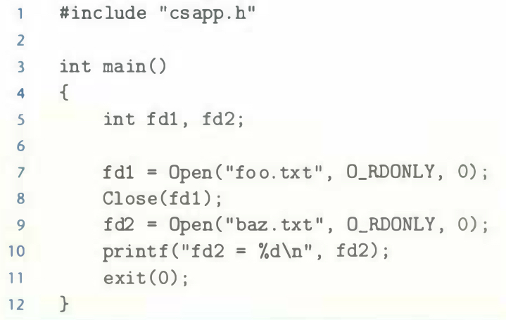

# Practice Problem 10.1 (solution page 915)
What is the output of the following program?



## Solution:

```
fd2 = 3
```
- Each process created by a Linux shell begins life with three open files: standard input, standard output, standard error.
- The smallest descriptor that is not currently open is 3
- After `fd1` closes, the descriptor 3 is restored to available descriptors.
- Therefore `fd2` is also 3