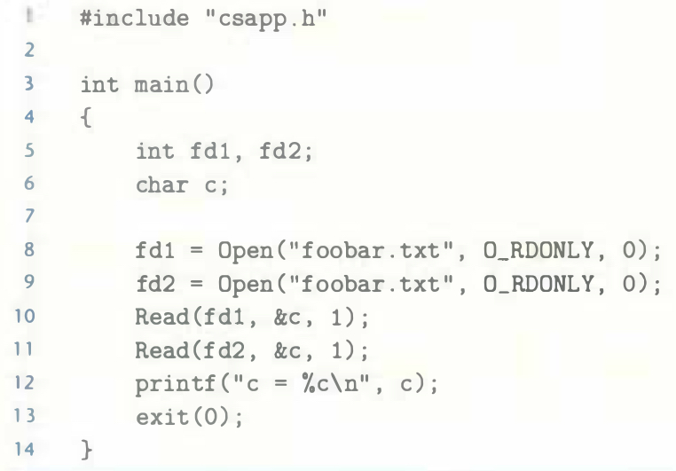

# Practice Problem 10.2 (solution page 915)
Suppose the disk file `foobar.txt` consists of the six ASCII characters `foobar`.
Then what is the output of the following program?



## Solution:

```
c = f
```
- `fd1` and `fd2` have two different open file entries which have distinct file positions