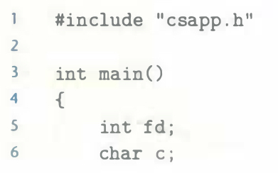
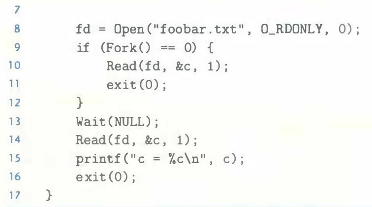

# Practice Problem 10.3 (solution page 915)
As before, suppose the disk file `foobar.txt` consists of the six ASCII characters `foobar`. Then what is the output of the following program?





## Solution:

```
c = o
```
- The parent and child process share the same open file entry and share the file position. 