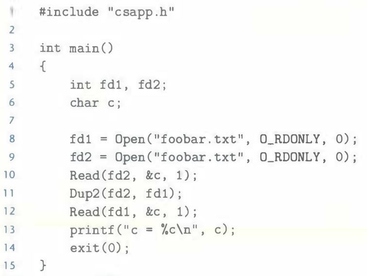
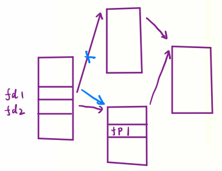

# Practice Problem 10.5 (solution page 916)
Assuming that the disk file `foobar.txt` consists of the six ASCII characters `foobar`, what is the output of the following program?



## Solution:

```
c = o
```
- Data structure:

    

- `fd1` and `fd2` share the same open file table entry and file position.
- `fd2` moves the file position to 1, thus, `fd1` reads the character from file position 1 which is `o`.

