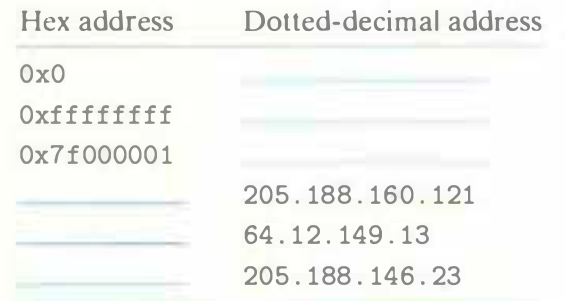

# Practice Problem 11.1 (solution page 966)
Complete the following table:

## Solution:

Hex address | Dotted-decimal address
-|-
0x0|0.0.0.0
0xffffffff|255.255.255.255
0x7f000001|127.0.0.1
0xcdbca079|205.188.160.121
~~0x400c850d~~ 0x400c950d|64.12.149.13
~~0xcdbc8217~~ 0xcdbc9217|205.188.146.23

- $205 = 16 * 12 + 13$
- $188 = 16 * 11 + 12$
- $160 = 16 * 10 + 0$
- $121 = 16 * 7 + 9$
- ~~149 = 16 * 8 + 5~~
- $149 = 16 * 9 + 5$