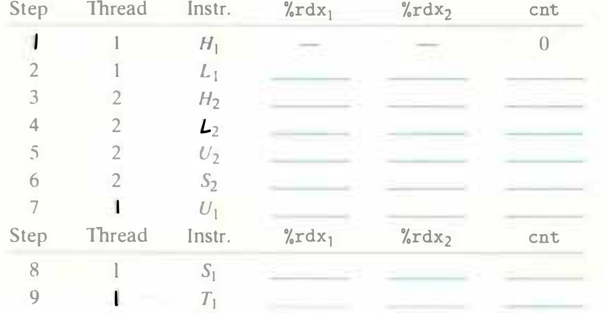

# Practice Problem 12.7 (solution page 1037)
Complete the table for the following instruction ordering of `badcnt.c`:

Does this ordering result in a correct value for `cnt`?

## Solution:

Step|Thread|instr.|`%rdx`$_1$|`%rdx`$_2$|`cnt`
-|-|-|-|-|-
1|1|$H_1$|-|-|0
2|1|$L_1$|0|-|0
3|2|$H_2$|-|-|0
4|2|$L_2$|-|0|0
5|2|$U_2$|-|1|0
6|2|$S_2$|-|1|1
7|1|$U_1$|1|-|1
8|1|$S_1$|1|-|1
9|1|$T_1$|1|-|1
10|2|$T_2$|-|1|1

- No, not correct value for `cnt`