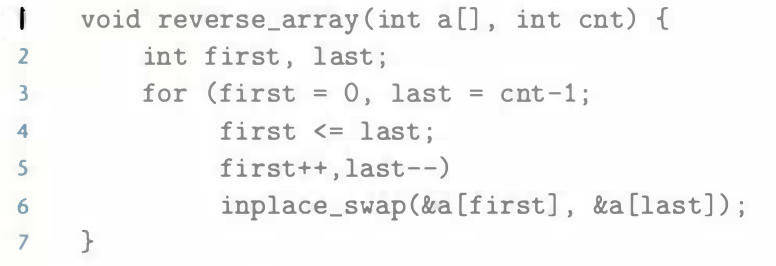

# Practice Problem 2.11 (solution page 146)
Armed with the function `inplace_swap` from Problem 2.10, you decide to write code that will reverse the elements of an array by swapping element from opposite ends of the array, working toward the middle.

You arrive at the following function:

When you apply your function to an array containing elements 1, 2, 3, and 4, you find the array now has, as expected, elements 4, 3, 2, and 1. When you try it on an array with elements 1, 2, 3, 4, and 5, however. you are surprised to see that the array now has elements 5, 4, 0, 2, and 1. In fact, you discover that the code always works correctly on arrays of even length. but it sets the middle element to 0 whenever the array has odd length.

A. For an array of odd length cnt = `2k + 1`, what are the values of variables `first` and `last` in the final iteration of function `reverse_ array`?

B. Why does this call to function `inplace_swap` set the array element to `O`?

C. What simple modification to the code for `reverse_array` would eliminate this problem?

## Solution:
A. `first: k, last: k`

B. `x` and `y` is the same value, in step 1, changing `*y` will cause `*x` changed. 

|Step|`*x`|`*y`|
|-|-|-|
|Initially|`a`|`a`|
|Step 1|`0`|`a ^ a = 0`|
|Step 2|`0`|`0`|
|Step 3|`0`|`0`|

C. Make `first` will not be equal to `last`: line 4 `first < last`

If cnt = `2k + 1`, when `first = last = k`, there is no need to swap the value.