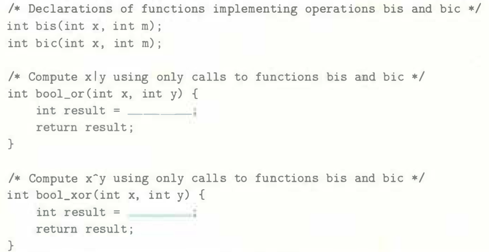

# Practice Problem 2.13 
Solution page 147

The Digital Equipment VAX computer was a very popular machine from the late 1970s until the late 1980s. Rather than instructions for Boolean operations `AND` and `OR`, it had instructions `bis` (bit set) and `bic` (bit clear). Both instructions take a data word `x` and a mask word `m`. They generate a result `z` consisting of the bits of `x` modified according to the bits of `m`. With `bis`, the modification involves setting `z` to `1` at each bit position where `m` is `1`. With `bic`, the modification involves setting `z` to `O` at each bit position where `m` is `1`.

To see how these operations relate to the C bit-level operations, assume we have functions `bis` and `bic` implementing the bit set and bit clear operations, and that we want to use these to implement functions computing bitwise operations `|` and `^`, without using any other C operations. Fill in the missing code below. Hint: Write C expressions for the operations bis and bic.



## Solution:
`bis` is the same as `OR |`

```
x           0 0 1 1
y           0 1 0 1
^           0 1 1 0
bic(x, y)   0 0 1 0
bic(y, x)   0 1 0 0
```

`EXCLUSIVE-OR ^` is `OR` on `bic(x, y)` and `bic(y, x)`

```c
int bool_or(int x, int y) {
    int result = bis(x, y);
    return result;
}

int bool_xor(int x, int y) {
    int result = bis(bic(x, y), bic(y, x));
    return result;
}
```