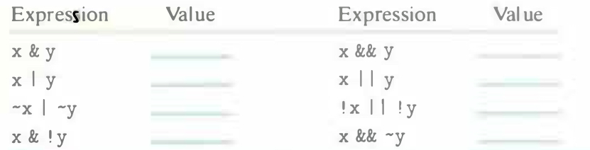

# Practice Problem 2.14
solution page 147

Suppose that x and y have byte values `0x66` and `0x39`, respectively. Fill in the following table indicating the byte values of the different C expressions:



## Solution:
```
x       0110 0110
y       0011 1001
x & y   0010 0000
x | y   0111 1111
~x      1001 1001
~y      1100 0110
~x | ~y 1101 1111
x & !y  0000 0000
```

|Expression|Value|Expression|Value|
|-|-|-|-|
| x & y | 0x20 | x && y | 0x01 |
|x \| y | 0x7F | x \|\| y | 0x01 |
| ~x \| ~y | 0xDF |!x \|\| !y | 0x00 |
| x & !y | 0x00 | x && ~y | 0x01 |