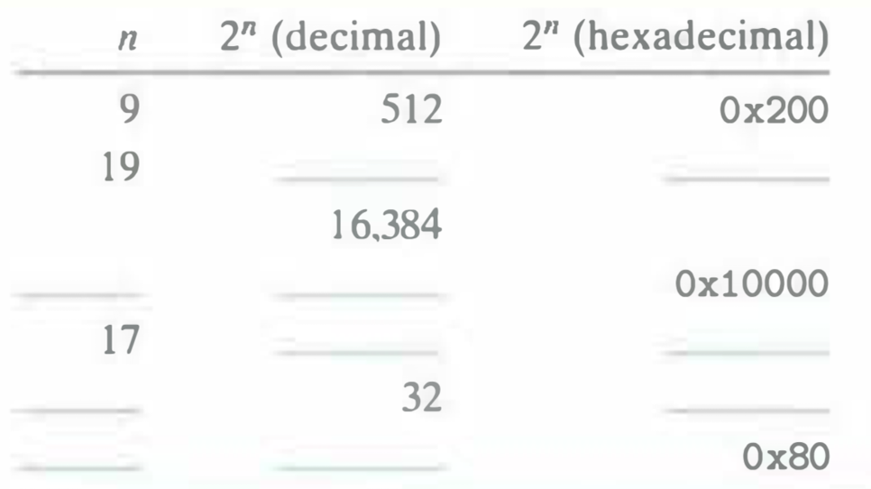

# Practice Problem 2.2
Solution page 143

Fill in the blank entries in the following table, giving the decimal and hexadecimal representations of different powers of 2:



## Solution:
```
n   2^n (decimal)   2^n (hexadecimal)
9   512             0x200
19  524288          0x80000
14  16384           0x4000
16  65536           0x10000
17  131072          0x20000
5   32              0x20
7   128             0x80
```