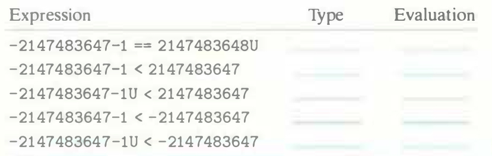

# Practice Problem 2.21
solution page 149

Assuming the expressions are evaluated when executing a 32-bit program on a machine that uses two's-complement arithmetic, fill in the following table describing the effect of casting and relational operations, in the style of Figure 2.19:

