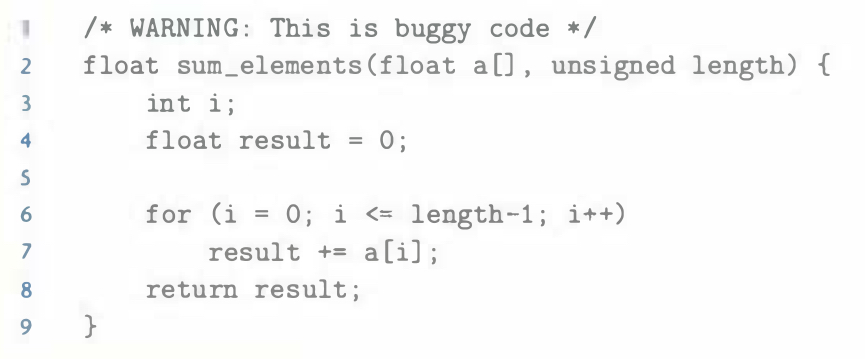

# Practice Problem 2.25
solution page 151

Consider the following code that attempts to sum the elements of an array `a`, where the number of elements is given by parameter `length`:

When run with argument `length` equal to 0, this code should return 0.0. Instead, it encounters a memory error. Explain why this happens. Show how this code can be corrected.

## Solution:
`length` is `unsigned` type, `length - 1` will convert `-1` to unsigned value $UMax_w$, therefore, `i` will range from 0 to $UMax_w$

Correct: `i <= length - 1` to `i < length`