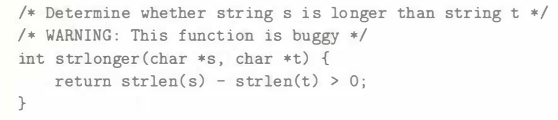

# Practice Problem 2.26
solution page 151

You are given the assignment of writing a function that determines whether one string is longer than another. You decide to make use of the string library function `strlen` having the following declaration:

```c
/* Prototype for library function strlen */
size_t strlen(const char *S) ;
```

Here is your first attempt at the function:



When you test this on some sample data, things do not seem to work quite right. You investigate further and determine that, when compiled as a 32-bit program, data type `size_t` is defined (via `typedef`) in header file `stdio.h` to be unsigned.

A. For what cases will this function produce an incorrect result?

B. Explain how this incorrect result comes about.

C. Show how to fix the code so that it will work reliably.

## Solution:
A. Length of s is less than length of t 

B. `strlen(s)` returns unsigned value. Minus between the unsigned values also returns unsigned value.

If length of s is less than length of t, `strlen(s) - strlen(t)` will yield a nonnegative value which is incorrect. 

C. `return strlen(s) - strlen(t) > 0;` to `return strlen(s) > strlen(t)`