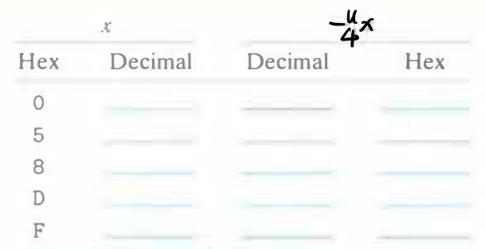

# Practice Problem 2.28
solution page 152

We can represent a bit pattern of length $w = 4$ with a single hex digit. For an unsigned interpretation of these digits, use Equation 2.12 to fill in the following table giving the values and the bit representations (in hex) of the unsigned additive inverses of the digits shown.

## Solution:
|x||$-_4^ux$||
|-|-|-|-|
|Hex|Decimal|Decimal|Hex|
|0|0|0|0|
|5|5|11|B|
|8|8|8|8|
|D|13|3|3|
|F|15|1|1|