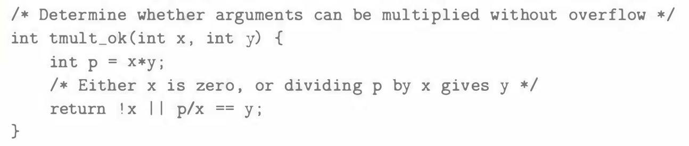

# Practice Problem 2.35 (solution page 154)
You are given the assignment to develop code for a function `tmult_ok` that will determine whether two arguments can be multiplied without causing overflow. Here is your solution:

You test this code for a number of values of $x$ and $y$, and it seems to work properly. Your coworker challenges you, saying, "If I can't use subtraction to test whether addition has overflowed (see Problem 2.31), then how can you use division to test whether multiplication has overflowed?"

Devise a mathematical justification of your approach, along the following lines. First, argue that the case $x = 0$ is handled correctly. Otherwise, consider $w$-bit numbers $x (x \neq 0)$, $y$, $p$, and $q$, where $p$ is the result of performing two's-complement multiplication on $x$ and $y$, and $q$ is the result of dividing $p$ by $x$.

1. Show that $x \cdot y$, the integer product of $x$ and $y$, can be written in the form $x \cdot y = p+ t2^w$, where $t \neq 0$ if and only if the computation of $p$ overflows.

1. Show that $p$ can be written in the form $p = x \cdot q + r$, where $|r| < |x|$.

1. Show that $q = y$ if and only if $r = t = 0$.

## Solution:

if $x=0$, $x*_w^ty$ will not cause overflow, indeed the function `tmult_ok` will return 1

### Step 1
$p = x*_w^ty = U2T_w((x \cdot y)\ mod \ 2^w)$

let $x \cdot y = 2^wa+b$ where $0 \leq b < 2^w$

$p = U2Tw(b) = b - b_{w-1}2^w$

$x \cdot y = 2^wa + p + b_{w-1}2^w = p + (a + b_{w-1})2^w$

let $t = a + b_{w-1}$, hence $x \cdot y = p + t2^w$

$p$ overflows $\iff x \cdot y \neq p \iff t2^w \neq 0 \iff t \neq 0$

### Step 2
$q$ is the result of dividing $p$ by $x$, therefore $p = x \cdot q + r$, where $|r| < |x|$

### Step 3
$q = y \iff x \cdot y - t2^w = x \cdot y+ r \iff t2^w + r = 0$

Due to $|r| < |x|$, hence $|r| < 2^w$

Therefore $t2^w+r=0 \iff t =0, r =0$

In conclusion if $q = y \iff t = 0 \iff p$ doesn't overflow