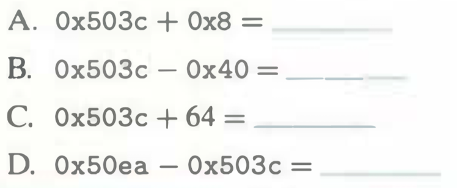

# Practice Problem 2.4
Solution page 144

Without converting the numbers to decimal or binary, try to solve the following arithmetic problems, giving the answers in hexadecimal.

Hint: Just modify the methods you use for performing decimal addition and subtraction to use base 16.



## Solution:
```
A. 0x503c + 0x8 = 0x5044

B. 0x503c - 0x40 = 0x4ffc 

C. 0x503c + 64 = 0x503c + 0x40 = 0x507c

D. 0x50ea - 0x503c = 0xae
```