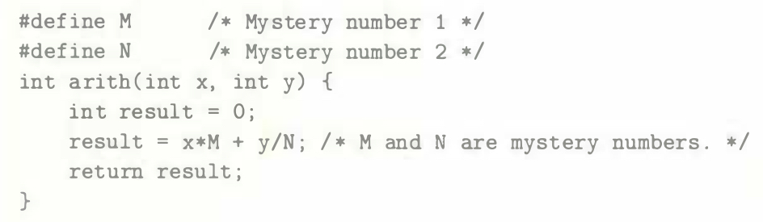
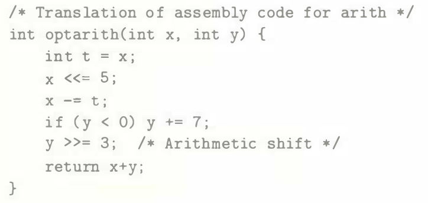

# Practice Problem 2.43 (solution page 157)
In the following code, we have omitted the definitions of constants `M` and `N`:

We compiled this code for particular values of `M` and `N`. The compiler optimized the multiplication and division using the methods we have discussed. The following is a translation of the generated machine code back into C:

What are the values of `M` and `N`?