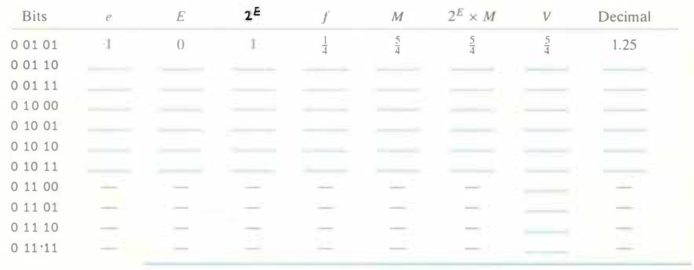

# Practice Problem 2.47 (solution page 158)
Consider a 5-bit floating-point representation based on the IEEE floating-point format, with one sign bit, two exponent bits ($k = 2$), and two fraction bits ($n = 2$). The exponent bias is $2^{2-1} - 1 = 1$

The table that follows enumerates the entire nonnegative range for this 5-bit floating-point representation. Fill in the blank table entries using the following directions:

$e$: The value represented by considering the exponent field to be an unsigned integer

$E$: The value of the exponent after biasing

$2^E$: The numeric weight of the exponent

$f$: The value of the fraction

$M$: The value of the significand

$2^E \times M$: The (unreduced) fractional value of the number

$V$: The reduced fractional value of the number

Decimal: The decimal representation of the number

Express the values of $2^E$, $f$, $M$, $2^E \times M$, and $V$ either as integers (when possible) or as fractions of the form $\frac{x}{y}$, where $y$ is a power of 2. You need not
fill in entries marked `-`.

