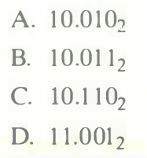

# Practice Problem 2.50 (solution page 159)
Show how the following binary fractional values would be rounded to the nearest half (1 bit to the right of the binary point), according to the round-to-even rule. In each case, show the numeric values, both before and after rounding.

## Solution:
A. 10.0102
В. 10.0112
С. 10.1102
D. 11.0012
