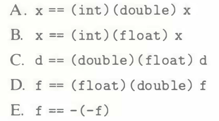
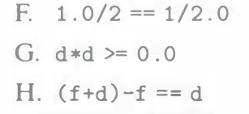

# Practice Problem 2.54 (solution page 160)
Assume variables `x`, `f`, and `d` are of type `int`, `float`, and `double`, respectively. Their values are arbitrary, except that neither `f` nor `d` equals $+\infty$, $-\infty$, or $NaN$.
For each of the following C expressions, either argue that it will always be true (i.e., evaluate to 1) or give a value for the variables such that it is not true (i.e., evaluates to 0).

## Solution:
A. x == (int) (double) x
B. x == (int) (float) x
C. d == (double) (float) d
D. f = (float) (double) f
E. f == -(-f)