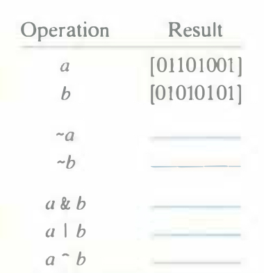

# Practice Problem 2.8
Solution page 145

Fill in the following table showing the results of evaluating Boolean operations on bit vectors.



## Solution:
```
~a      10010110
~b      01010101
a & b   01000001
a | b   01111101
a ^ b   00111100
```