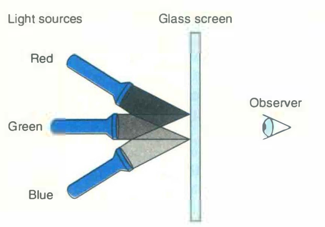
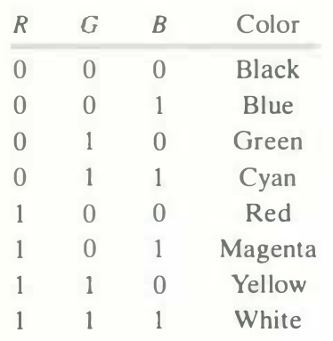
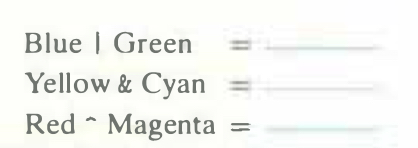

# Practice Problem 2.9
solution page 146

Computers generate color pictures on a video screen or liquid crystal display by mixing three different colors of light: red, green, and blue. Imagine a simple scheme, with three different lights, each of which can be turned on or off, project­ing onto a glass screen:



We can then create eight different colors based on the absence (0) or presence (1) of light sources R, G, and B:



Each of these colors can be represented as a bit vector of length 3, and we can apply Boolean operations to them.

A. The complement of a color is formed by turning off the lights that are on and turning on the lights that are off. What would be the complement of each of the eight colors listed above?

B. Describe the effect of applying Boolean operations on the following colors:



## Solution:
A.
|Color|RGB|~RGB|Complement color|
|-|-|-|-|
|Black|000|111|While|
|Blue|001|110|Yello|
|Green|010|101|Magenta|
|Cyan|011|100|Red|
|Red|100|011|Cyan|
|Magenta|101|010|Green|
|Yellow|110|001|Blue|
|White|111|000|Black|

B.

```
Blue | Green = 001 | 010 = 011 = Cyan
Yellow & Cyan = 110 & 011 = 010 = Green
Red ^ Magenta = 100 ^ 101 = 001 = Blue
```