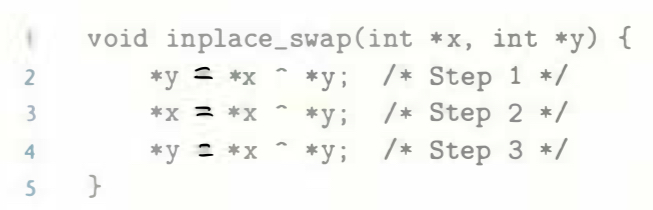

# Practice Problem 2.10 (solution page 146)
As an application of the property that `a ^ a = 0` for any bit vector `a`, consider the following program:

As the name implies, we claim that the effect of this procedure is to swap the values stored at the locations denoted by pointer variables `x` and `y`. Note that unlike the usual technique for swapping two values, we do not need a third location to temporarily store one value while we are moving the other. There is no performance advantage to this way of swapping; it is merely an intellectual amusement.

Starting with values `a` and `b` in the locations pointed to by `x` and `y`, respectively, fill in the table that follows, giving the values stored at the two locations after each step of the procedure. Use the properties of `^` to show that the desired effect is achieved. Recall that every element is its own additive inverse (that is, `a ^ a = 0`).

## Solution:
|Step|`*x`|`*y`|
|-|-|-|
|Initially|`a`|`b`|
|Step 1|`a`|`a ^ b`|
|Step 2|`a ^ (a ^ b) = b`|`a ^ b`|
|Step 3|`b`|`b ^ (a ^ b) = a`|