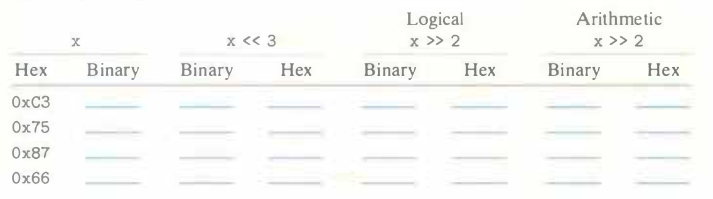

# Practice Problem 2.16 (solution page 148)
Fill in the table below showing the effects of the different shift operations on single­-byte quantities. The best way to think about shift operations is to work with binary representations. Convert the initial values to binary, perform the shifts, and then convert back to hexadecimal. Each of the answers should be 8 binary digits or 2 hexadecimal digits.

## Solution:
|x||x << 3||Logical x >> 2|| Arithmetic x >> 2||
|-|-|-|-|-|-|-|-|
|Hex|Binary|Binary|Hex|Binary|Hex|Binary|Hex|
|0xC3|1100 0011|0001 1000|0x18|0011 0000|0x30|1111 0000|0xF0|
|0x75|0111 0101|1010 1000|0xA8|0001 1101|0x1D|0001 1101|0x1D|
|0x87|1000 0111|0011 1000|0x38|0010 0001|0x21|1110 0001|0xE1|
|0x66|0110 0110|0011 0000|0x30|0001 1001|0x19|0001 1001|0x19|