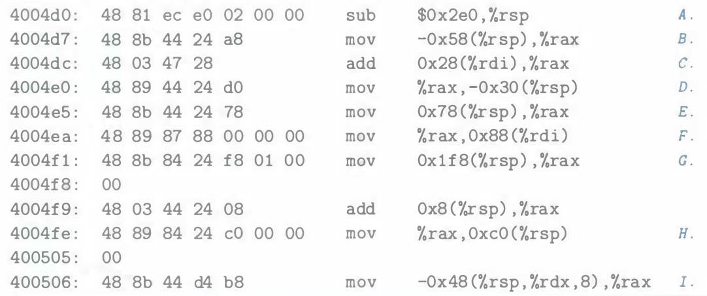

# Practice Problem 2.18 (solution page 149)
In Chapter 3, we will look at listings generated by a disassembler, a program that converts an executable program file back to a more readable ASCII form. These files contain many hexadecimal numbers, typically representing values in two's-complement form. Being able to recognize these numbers and understand their significance (for example, whether they are negative or positive) is an important skill.

For the lines labeled A-I (on the right) in the following listing, convert the hexadecimal values (in 32-bit two's-complement form) shown to the right of the instruction names (`sub`, `mov`, and `add` ) into their decimal equivalents:

## Solution:
A. `0x2e0`: $2 \times 16^2 + 14 \times 16 = 736$

B. `-0x58`: $- (5 * 16 + 8) = -88$
- 88: `0101 1000`
- -88: `1111 ... 1111 1010 1000` -> `0xFFFFFFa8`
- In instruction bytes, we can see `a8`, but where are `F`s?

C. `0x28`: $2 \times 16 + 8 = 40$

D. `-0x30`: $- (3 \times 16) = -48$

E. `0x78`: $7 \times 16 + 8 = 120$

F. `0x88`: $8 \times 16 + 8 = 136$

G. `0x1f8`: $1 \times 16^2 + 15 \times 16 + 8 = 504$

H. `0xc0`: $12 \times 16 = 192$

I. `-0x48`: $-(4 * 16 + 8) = -72$