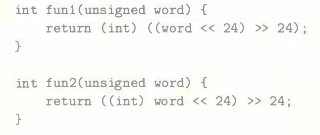
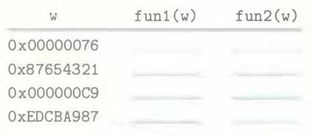

# Practice Problem 2.23 (solution page 150)
Consider the following C functions:

Assume these are executed as a 32-bit program on a machine that uses two's-complement arithmetic. Assume also that right shifts of signed values are performed arithmetically, while right shifts of unsigned values are performed logically.

A. Fill in the following table showing the effect of these functions for several example arguments. You will find it more convenient to work with a hexa­decimal representation. Just remember that hex digits 8 through F have their most significant bits equal to 1.

B. Describe in words the useful computation each of these functions performs.

## Solution:
A. Type conversion precedence is higher than bit shift

|`w`|`fun1(w)`|`fun2(w)`|
|-|-|-|
|`Ox00000076`|`Ox00000076`|`0x00000076`|
|`Ox87654321`|`0x00000021`|`0x00000021`|
|`Ox000000C9`|`0x000000C9`|`0xFFFFFFC9`|
|`OxEDCBA987`|`0x00000087`|`0xFFFFFF87`|

B.
- `func1(w)`: remain the least 8 significant bits, set other bits 0
    - Return unsigned the least significant byte
    - Return an integer ranging between 0 and 255

- `func2(w)`: 
    - Return signed the least significant byte 
    - Return an integer ranging between -128 and 127

   