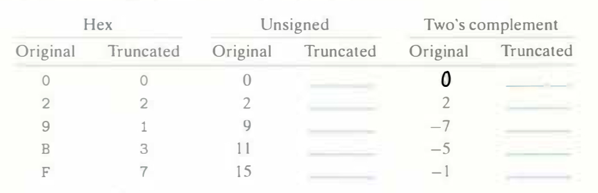

# Practice Problem 2.24 (solution page 150)
Suppose we truncate a 4-bit value (represented by hex digits O through F) to a 3-bit value (represented as hex digits 0 through 7.) Fill in the table below showing the effect of this truncation for some cases, in terms of the unsigned and two's­-complement interpretations of those bit patterns.

Explain how Equations 2.9 and 2.10 apply to these cases.

## Solution:
|Binary|Unsigned||Two's-complement||
|-|-|-|-|-|
|Original|Original|Truncated|Original|Truncated|
|`0000`|0|0|0|0|
|`0010`|2|2|2|2|
|`1001`|9|1|-7|1|
|`1011`|11|3|-5|3|
|`1111`|15|7|-1|-1|

Unsigned: $B2U_3([x_2, x_1, x_0]) = B2U_4([x_{3}, x_2, x_1, x_0]) \enspace mod \enspace 2^3$

Signed: $B2T_3([x_2, x_1, x_0]) = U2T_3(B2U_3([x_2, x_1, x_0])) = \\ u, \quad u \leq 3 \\ u - 2^3, \quad u > 3$