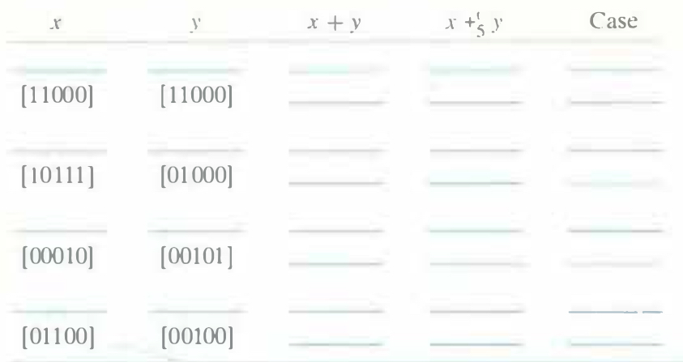

# Practice Problem 2.29 (solution page 152)
Fill in the following table in the style of Figure 2.25. Give the integer values of the 5-bit arguments, the values of both their integer and two's-complement sums, the bit-level representation of the two's-complement sum, and the case from the derivation of Equation 2.13

## Solution:
|$x$|$y$|$x+y$|$x+_5^ty$|Case|
|-|-|-|-|-|
|$-2^4+2^2=-12$|$-2^4+1=-15$|$-2^5+2^2+1=-27$|5|1|
|`10100`|`10001`|`100101`|`00101`||
|$-2^4+2^3=-8$|$-2^4+2^3=-8$|$-2^5+2^4=-16$|-16|2|
|`11000`|`11000`|`110000`|`10000`||
|$-2^4+2^2+2^1+1=-9$|$2^3=8$|-1|-1|2|
|`10111`|`01000`|`111111`|`11111`||
|2|$2^2+1=5$|$2^2+2^1+1=7$|7|3|
|`00010`|`00101`|`000111`|`00111`||
|$2^3+2^2=12$|4|16|-16|4|
|`01100`|`00100`|`010000`|`10000`||