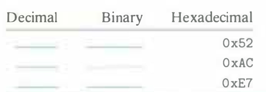

# Practice Problem 2.3 (solution page 144)
A single byte can be represented by 2 hexadecimal digits. Fill in the missing entries in the following table, giving the decimal, binary, and hexadecimal values of different byte patterns:

## Solutions:
Decimal|Binary|Hexadecimal
-|-|-
0|0000 0000|0x00
167|1010 0111|0xA7
62|0011 1110|0x3E
188|1011 1100|0xBC
55|0011 0111|0x37
136|1000 1000|0x88
243|1111 0011|0xF3
82|0101 0010|0x52
172|1010 1100|0xAC
231|1110 0111|0xE7