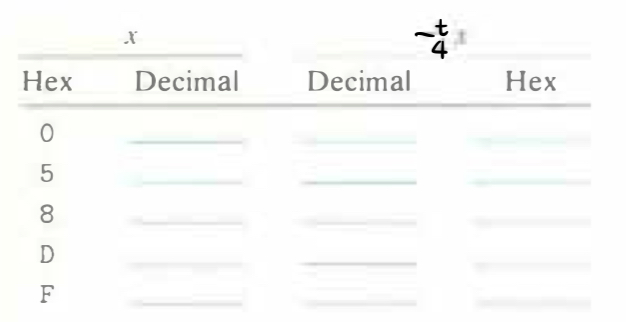

# Practice Problem 2.33 (solution page 153)
We can represent a bit pattern of length $w = 4$ with a single hex digit. For a two's­ complement interpretation of these digits, fill in the following table to determine the additive inverses of the digits shown:

What do you observe about the bit patterns generated by two's-complement and unsigned (Problem 2.28) negation?

## Solution:
|x|||$-_4^tx$|||
|-|-|-|-|-|-|
|Hex|Binary|Decimal|Decimal|Binary|Hex|
|0|`0000`|0|0|`0000`|0|
|5|`0101`|5|-5|`1011`|B|
|8|`1000`|-8|-8|`1000`|8|
|D|`1101`|-3|3|`0011`|3|
|F|`1111`|-1|1|`0001`|1|

These two bit-level representations are the same
