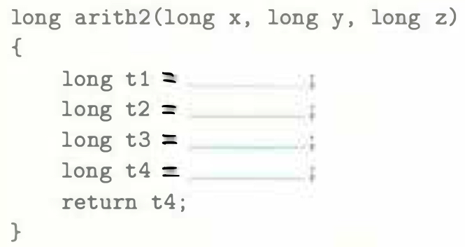
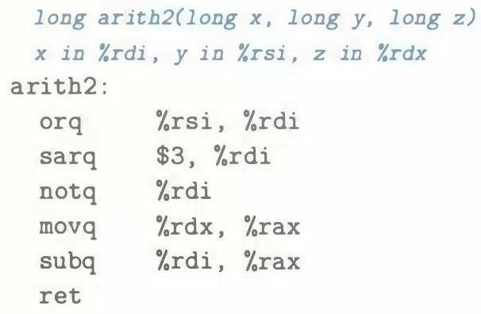

# Practice Problem 3.10 (solution page 329)
In the following variant of the function of Figure 3.11(a), the expressions have been replaced by blanks:

The portion of the generated assembly code implementing these expressions is as follows:

Based on this assembly code, fill in the missing portions of the C code.