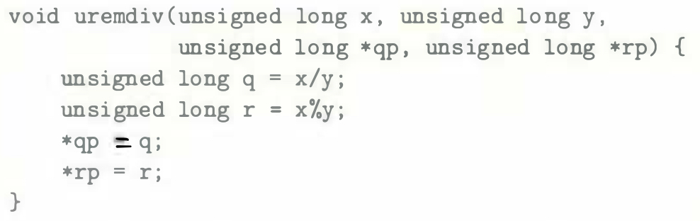

# Practice Problem 3.12 (solution page 329)

Consider the following function for computing the quotient and remainder of two unsigned 64-bit numbers:



Modify the assembly code shown for signed division to implement this function.

### Solutions:
modified assembly code:
```
void uremdiv(unsigned long x, unsigned long y, unsigned long *qp, unsigned long *rp)
x in %rdi, y in %rsi, qp in %rdx, rp in %rcx
```
```
uremdiv:
movq %rdx, %r8
movq %rdi, %rax
movl $0, %rdx
divq %rsi
movq %rax, (%r8)
movq %rdx, (%rcx)
ret
```