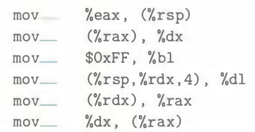

# Practice Problem 3.2 (solution page 325)
For each of the following lines of assembly language, determine the appropriate instruction suffix based on the operands. (For example, `mov` can be rewritten as `movb`, `movw`, `movl`, or `movq`.)

