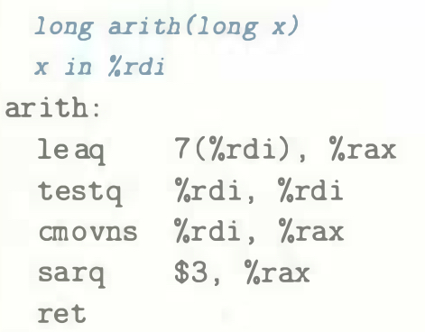

# Practice Problem 3.20 (solution page 333)
In the following C function, we have left the definition of operation `OP` incomplete:

When compiled, gcc generates the following assembly code:

A. What operation is `OP`?

B. Annotate the code to explain how it works.