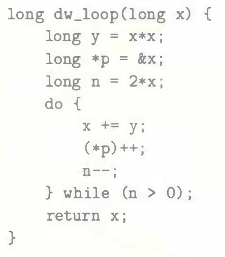
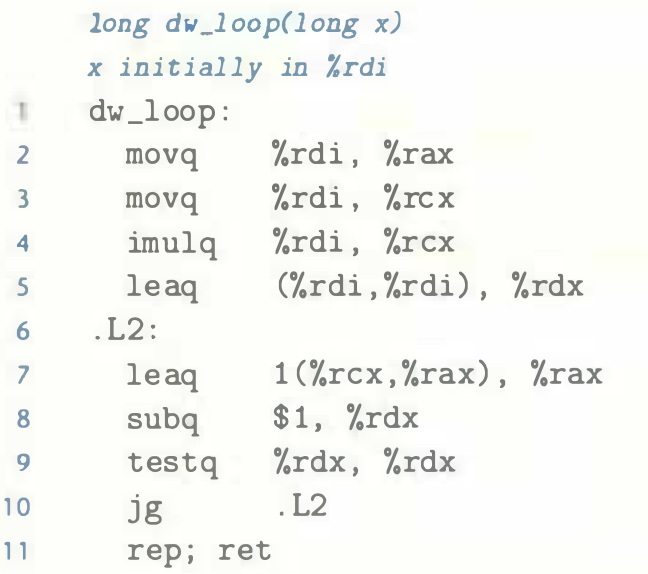

# Practice Problem 3.23 (solution page 334)
For the C code

`GCC` generates the following assembly code:

A. Which registers are used to hold program values `x`, `y`, and `n`?

B. How has the compiler eliminated the need for pointer variable `p` and the pointer dereferencing implied by the expression `(*p)++`?

C. Add annotations to the assembly code describing the operation of the program, similar to those shown in Figure 3.19(c).