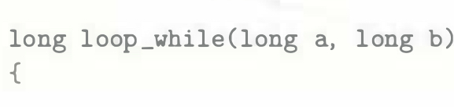
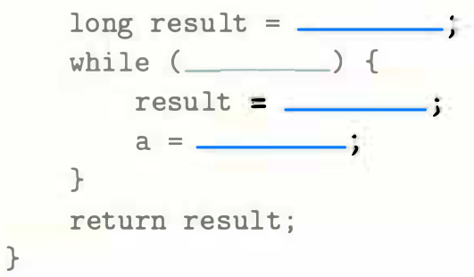
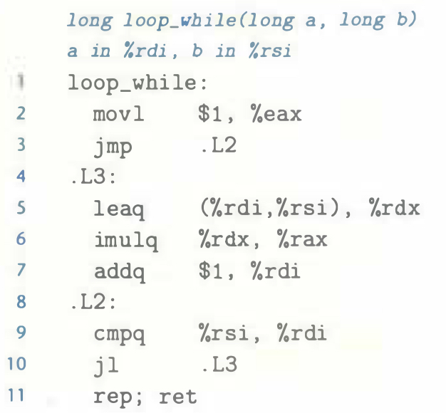

# Practice Problem 3.24 (solution page 335)
For C code having the general form

`GCC`, run with command-line option `-Og`, produces the following code:

We can see that the compiler used a jump-to-middle translation, using the `jmp` instruction on line 3 to jump to the test starting with label `.L2`. Fill in the missing parts of the C code.