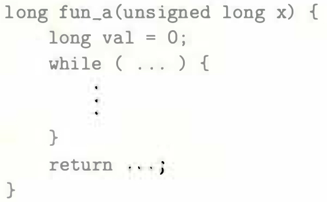
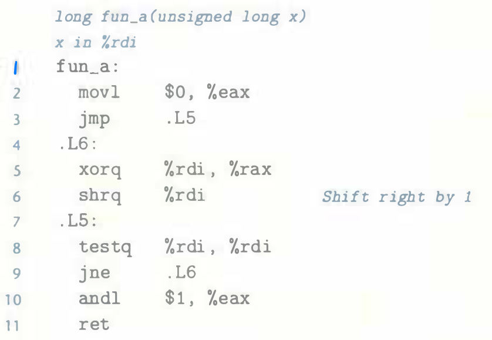

# Practice Problem 3.26 (solution page 336)
A function `fun_a` has the following overall structure:

The `GCC` C compiler generates the following assembly code:

Reverse engineer the operation of this code and then do the following:

A. Determine what loop translation method was used.

B. Use the assembly-code version to fill in the missing parts of the C code.

C. Describe in English what this function computes.