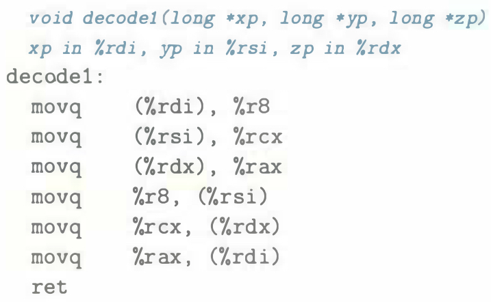

# Practice Problem 3.5 (solution page 327)
You are given the following information. A function with prototype

```c
void decode1(long *xp, long *yp, long *zp);
```

is compiled into assembly code, yielding the following:



Parameters `xp`, `yp`, and `zp` are stored in registers `%rdi`, `%rsi`, and `%rdx`, respectively.

Write C code for `decode1` that will have an effect equivalent to the assembly code shown.

### Solution:?

`%r8`, `%rcx`, `%rax` store local variables

Code: [decode1](../../problems/3/3.5.c)
