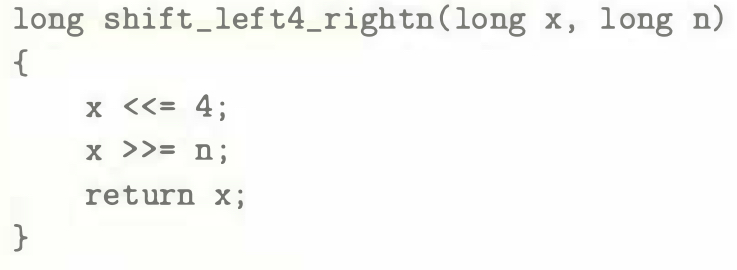
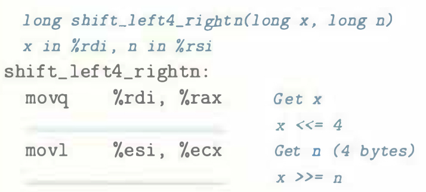

# Practice Problem 3.9 (solution page 328)
Suppose we want to generate assembly code for the following C function:

The code that follows is a portion of the assembly code that performs the actual shifts and leaves the final value in register `%rax`. Two key instructions have been omitted. Parameters `x` and `n` are stored in registers `%rdi` and `%rsi`, respectively.

Fill in the missing instructions, following the annotations on the right. The right shift should be performed arithmetically.