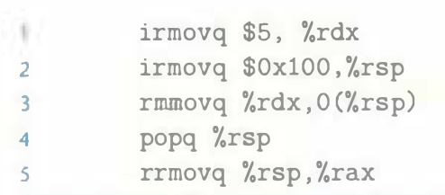

# Practice Problem 4.32 (solution page 490)
Suppose the order of the third and fourth cases (the two forwarding sources from the memory stage) in the HCL code for `d_valA` were reversed. Describe the resulting behavior of the `rrmovq` instruction (line 5) for the following program:

## Solution:
- There is load/use hazard, `rrmovq` will be stalled for one cycle
    - In the memory stage, `popq %rsp` will set both `M_dstE` and `M_dstM` to `%rsp` 

- If the third and fourth cases were reversed, `rrmovq` will set `M_valE` (value: `0x98`) not `m_valM` (value: `5`) to register `%rsp` in the decode stage
    - Therefore `rrmovq` instruction will set `rax` to `0x98`