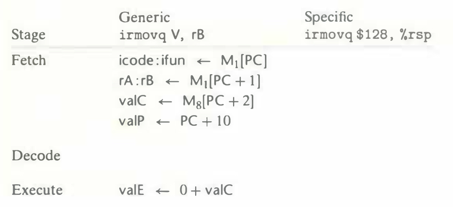
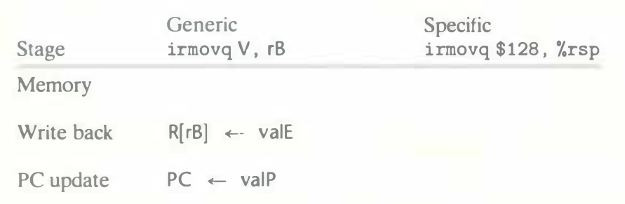

# Practice Problem 4.13
solution page 485

Fill in the right-hand column of the following table to describe the processing of the `irmovq` instruction on line 4 of the object code in Figure 4.17:

How does this instruction execution modify the registers and the PC?

## Solution:

|Stage|Generic `irmovq V, rB`|Specific `irmovq $128, %rsp`|
|-|-|-|
|Fetch|icode : ifun $\leftarrow$ $M_1$[PC]|icode: ifun $\leftarrow$ $M_1$[0x016] = 3 : 0|
||rA : rB $\leftarrow$ $M_1$[PC + 1]|rA : rB $\leftarrow$ $M_1$[0x017] = f : 4|
||valC $\leftarrow$ $M_8$[PC + 2]|valC $\leftarrow$ $M_8$[0x018] = 0x80 = 128|
||valP $\leftarrow$ PC + 10|valP $\leftarrow$ 0x016 + 10 = 0x020|
|Decode|||
|Execute|valE $\leftarrow$ 0 + valC|valE $\leftarrow$ 0 + 128 = 128|
|Memory|||
|Write back|R[rB] $\leftarrow$ valE|R[%rsp] $\leftarrow$ valE = 128|
|PC update|PC $\leftarrow$ valP|PC $\leftarrow$ valP = 0x020|

- Register:
    - In the write back stage, the instruction modifies `%rsp` value to `128`
- PC:
    - In the PC update stage, the instruction increments `PC` by `10` to `0x020`