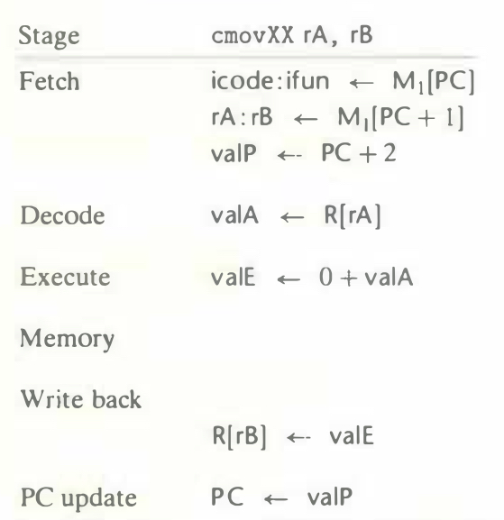

# Practice Problem 4.17 (solution page 486)
We can see by the instruction encodings (Figures 4.2 and 4.3) that the `rrmovq` instruction is the unconditional version of a more general class of instructions that include the conditional moves. Show how you would modify the steps for the `rrmovq` instruction below to also handle the six conditional move instructions. You may find it useful to see how the implementation of the jXX instructions (Figure 4.21) handles conditional behavior.

## Solution:

|Stage|`rrmovq rA, rB`|`cmovXX rA, rB`|
|-|-|-|
|Fetch|icode : ifun $\leftarrow$ $M_1$[PC]|icode : ifun $\leftarrow$ $M_1$[PC]|
||rA : rB $\leftarrow$ $M_1$[PC + 1]|rA : rB $\leftarrow$ $M_1$[PC + 1]|
||valP $\leftarrow$ PC + 2|valP $\leftarrow$ PC + 2|
|Decode|valA $\leftarrow$ R[rA]|valA $\leftarrow$ R[rA]|
|Execute|valE $\leftarrow$ 0 + valA|valE $\leftarrow$ 0 + valA|
|||Cnd $\leftarrow$ Cond(CC, ifun)|
|Memory|||
|Write back|R[rB] $\leftarrow$ valE|if (Cnd) R[rB] $\leftarrow$ valE|
|PC update|PC $\leftarrow$ valP|PC $\leftarrow$ valP|