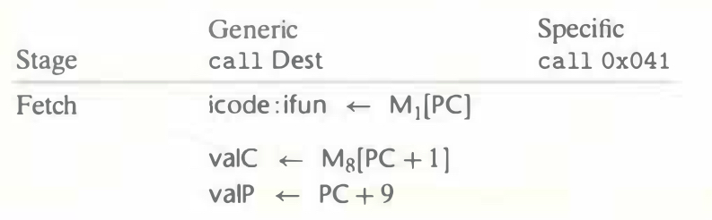
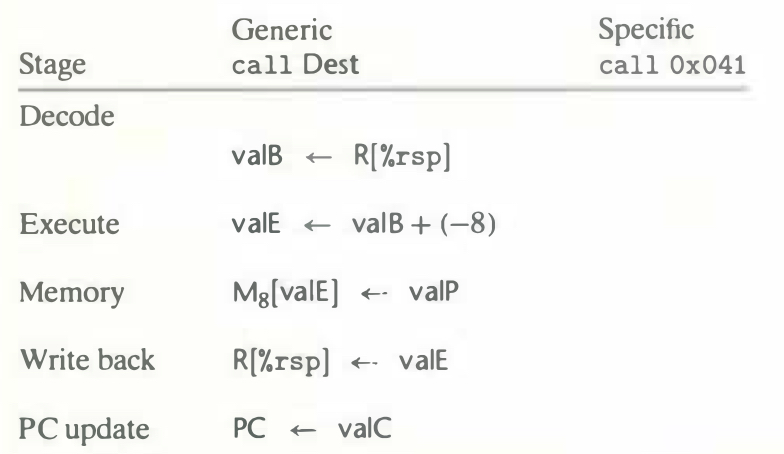

# Practice Problem 4.18 (solution page 487)
Fill in the right-hand column of the following table to describe the processing of the `call` instruction on line 9 of the object code in Figure 4.17:

What effect would this instruction execution have on the registers, the PC, and the memory?

## Solution:

- The address of `call proc` is `0x037`
- The value of `%rsp` is 128

|Stage|Generic `call Dest`|Specific `call 0x041`|
|-|-|-|
|Fetch|icode : ifun $\leftarrow$ $M_1$[PC]|icode: ifun $\leftarrow$ $M_1$[0x037] = 8 : 0|
||valC $\leftarrow$ $M_8$[PC + 1]|valC $\leftarrow$ $M_8$[PC + 1] = 0x041|
||valP $\leftarrow$ PC + 9|valP $\leftarrow$ 0x037 + 9 = 0x040|
|Decode|||
||valB $\leftarrow$ R[%rsp]|valB $\leftarrow$ R[%rsp] = 128|
|Execute|valE $\leftarrow$ valB + (-8)|valE $\leftarrow$ 128 + (-8) = 120|
|Memory|$M_8$[valE] $\leftarrow$ valP|$M_8$[120] $\leftarrow$ 0x040|
|Write back|R[%rsp] $\leftarrow$ valE|R[%rsp] $\leftarrow$ valE = 120|
|PC update|PC $\leftarrow$ valC|PC $\leftarrow$ valC = 0x041|

- This insturction sets register `%rsp` to 120, sets PC to `0x041` (the call target), and stores `0x040` (return address) at memory location `120`