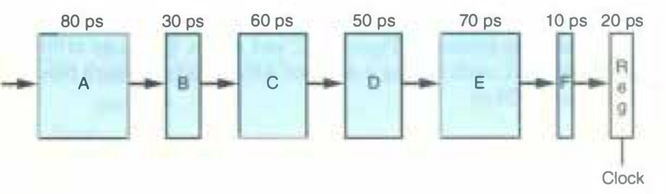

# Practice Problem 4.28 (solution page 489)

Suppose we analyze the combinational logic of Figure 4.32 and determine that it can be separated into a sequence of six blocks, named A to F, having delays of 80, 30, 60, 50, 70, and 10 ps, respectively, illustrated as follows:

We can create pipelined versions of this design by inserting pipeline registers between pairs of these blocks. Different combinations of pipeline depth (how many stages) and maximum throughput arise, depending on where we insert the pipeline registers. Assume that a pipeline register has a delay of 20 ps.

A. Inserting a single register gives a two-stage pipeline. Where should the register be inserted to maximize throughput? What would be the throughput and latency?

B. Where should two registers be inserted to maximize the throughput of a three-stage pipeline? What would be the throughput and latency?

C. Where should three registers be inserted to maximize the throughput of a 4-stage pipeline? What would be the throughput and latency?

D. What is the minimum number of stages that would yield a design with the maximum achievable throughput? Describe this design, its throughput, and its latency.

## Solution:

A.

Insert between B and C: A-B 110, C-F 190, clock cycle 20 + 190 = 210

Insert between C and D: A-C 170, D-F 130, clock cycle 20 + 170 = 190 

Therefore, insert between C and D to achieve maximal throughput

Throughput = 1 / 190 ps = 5.26 GIPS

Latency = 190 * 2 = 380 ps

B. 

1st register has to be inserted before C-D

- 1st register A-B: A 80
    - 2nd register C-D: B-C 90, D-F 130
    - 2nd register D-E: B-D 140, E-F 80
    - minimal clock cyle: 130 + 20 = 150

- 1st register B-C: A-B 110
    - 2nd register D-E: C-D 110, E-F 80
    - minimal clock cyle: 110 + 20 = 130

Therefore, insert beween B and C, D and E to achieve maximal throughput

Throughput = 1 / 130 ps = 7.69 GIPS

Latency = 130 * 3 = 390 ps

C. 

1st register A-B: A 80

2nd register C-D: B-C 90

3rd register D-E: D 50, E-F 80

Clock cycle: 90 + 20 = 110 ps

Throughput = 1 / 110 ps = 9.09 GIPS

Latency = 110 * 4 = 440 ps

D. 

Minimum number of stages: 5

A - reg - B - reg - C - reg - D - reg - E - F - reg

Clock cycle: 80 + 20 = 100 ps

Throughput = 1 / 100 ps = 10 GIPS

Latency = 100 * 5 = 500 ps