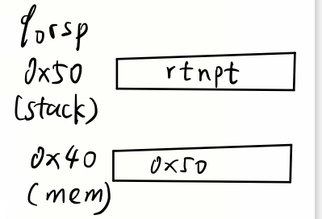

# Practice Problem 4.38 (solution page 492)
Write a Y86-64 assembly-language program that causes combination B to arise and completes with a `halt` instruction if the pipeline operates correctly.

## Solution:
<!-- ```
    call proc
    halt

proc:
    pushq %rsp
    mrmovq 0(%rsp), %rsp
    ret
``` -->

```
1       irmovq mem, %rbx
2       mrmovq 0(%rbx), %rsp
3       ret
4       halt
5   rtnpt:
6       irmovq $5, %rsi 
7       halt

8   .pos 0x40
9   mem:
10      .quad stack

11  .pos 0x50
12  stack:
13      .quad rtnpt
```

- Line 8-13:

    
    - We want to use `mrmovq` instruction, otherwise we can use `irmovq stack %rsp` to achieve the same effect 

- If line 2 and 3 operate correctly, line 6 will be executed

