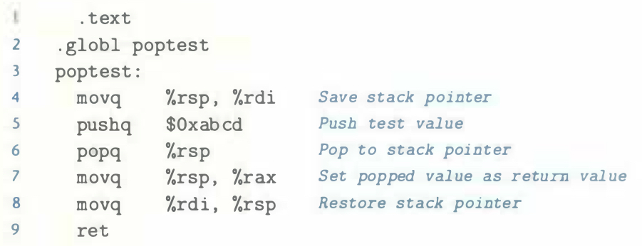

# Practice Problem 4.8 (solution page 484)

The following assembly-code function lets us determine the behavior of the in­struction `popq %rsp` for x86-64:

We find this function always returns `Oxabcd`. What does this imply about the behavior of `popq %rsp`? What other Y86-64 instruction would have the exact same behavior?

## Solution
This implies `popq %rsp` will pop the memory value to the `%rsp`

Other instruction has the same behavior: `mrmovq (%rsp), %rsp`