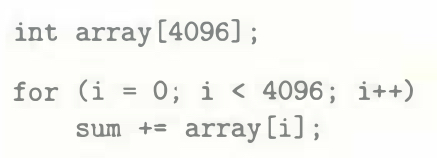

# Practice Problem 6.11 (solution page 663)
Imagine a hypothetical cache that uses the high-order bits of an address as the set index. For such a cache, contiguous chunks of memory blocks are mapped to the same cache set.

A. How many blocks are in each of these contiguous array chunks?

B. Consider the following code that runs on a system with a cache of the form $(S, E, B, m)=(512,1,32,32)$:

What is the maximum number of array blocks that are stored in the cache at any point in time?

## Solution:

A.
- $2^{m - s - b} = 2^t$

B.
- $m = 32$, $b = 5$, $s = 9$, $t = 18$
- One block 32 bytes
- Array size: $4 \times 4096 = 2^{2+12} = 2^{14}$, which is $2^9$ blocks
- $2^{18}$ blocks are in each of the contiguous array chunks, which is larger than the total array size
- Thus, the maxium number of array blocks in the cache is 2
- Answer is 1, but is it possible for the array to span two contiguous array chunks which have different set index?

