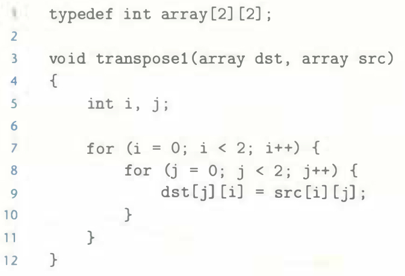
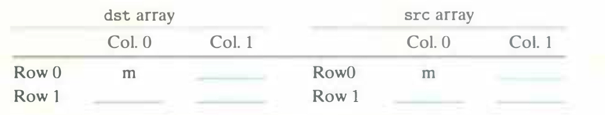
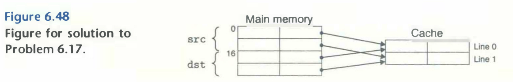

# Practice Problem 6.17 (solution page 665)
Transposing the rows and columns of a matrix is an important problem in signal processing and scientific computing applications. It is also interesting from a locality point of view because its reference pattern is both row-wise and column-wise. For example, consider the following transpose routine:

Assume this code runs on a machine with the following properties:
- `sizeof(int)` = 4.
- The `src` array starts at address 0 and the `dst` array starts at address 16 (decimal).

- There is a single L1 data cache that is direct-mapped, write-through, and write-allocate, with a block size of 8 bytes.
- The cache has a total size of 16 data bytes and the cache is initially empty.
- Accesses to the `src` and `dst` arrays are the only sources of read and write misses, respectively.

A. For each `row` and `col`, indicate whether the access to `src[row][col]` and `dst[row][col]` is a hit (h) or a miss (m). For example, reading `src[0][0]` is a miss and writing `dst[0][0]` is also a miss.

B. Repeat the problem for a cache with 32 data bytes.

## Solution:

A.

- Block 8 bytes, $b = 3$
- Cache 16 bytes, direct-mapped, $S = 2$, $s = 1$
- Mapping of blocks to sets:

    |Element|Address|Set index|
    |-|-|-|
    |src00|0|0|
    |src01|4|0|
    |src10|8|1|
    |src11|12|1|
    |dst00|16|0|
    |dst01|20|0|
    |dst10|24|1|
    |dst11|28|1|

    

- Sequence of reads and writes:

    |Set|Block||
    |-|-|-|
    |0|src00|src01|
    |0|dst00|dst01|
    |0|src00|src01|
    |1|dst10|dst11|
    |1|src10|src11|
    |0|dst00|dst01|
    |1|dst10|dst11|

- Hit or miss answer:

    ||`dst` array|||`src` array||
    |-|-|-|-|-|-|
    ||Col. 0|Col. 1||Col. 0|Col. 1|
    |Row 0|m|m|Row 0|m|m|
    |Row 1|m|m|Row 1|m|h|

B. 

- Block 8 bytes, $b = 3$
- Cache 32 bytes, direct-mapped, $S = 4$, $s = 2$
- Mapping of blocks to sets:

    |Element|Address|Set index|
    |-|-|-|
    |src00|0|0|
    |src01|4|0|
    |src10|8|1|
    |src11|12|1|
    |dst00|16|2|
    |dst01|20|2|
    |dst10|24|3|
    |dst11|28|3|

- Sequence of reads and writes:

    |Set|Block||
    |-|-|-|
    |0|src00|src01|
    |2|dst00|dst01|
    |3|dst10|dst11|
    |1|src10|src11|

- Hit or miss answer:

    ||`dst` array|||`src` array||
    |-|-|-|-|-|-|
    ||Col. 0|Col. 1||Col. 0|Col. 1|
    |Row 0|m|h|Row 0|m|h|
    |Row 1|m|h|Row 1|m|h|
