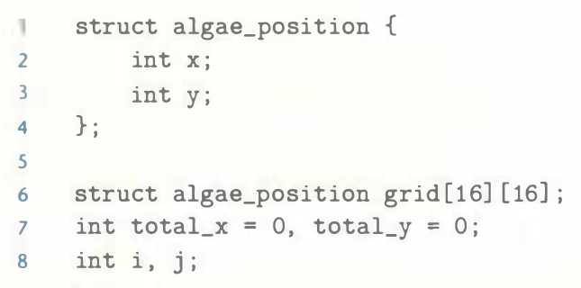
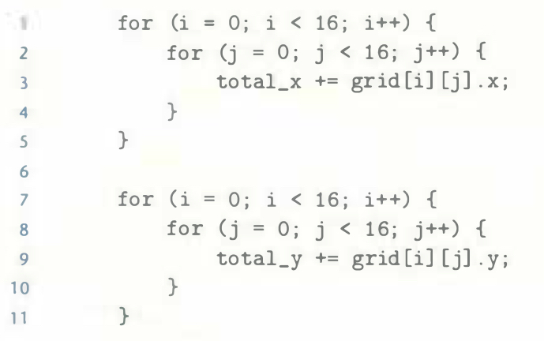

# Practice Problem 6.18 (solution page 666)
The heart of the recent hit game Sim Aquarium is a tight loop that calculates the average position of 256 algae. You are evaluating its cache performance on a machine with a 1,024-byte direct-mapped data cache with 16-byte blocks ($B = 16$).

You are given the following definitions:

You should also assume the following:
- `sizeof(int)` = 4.
- `grid` begins at memory address 0.
- The cache is initially empty.
- The only memory accesses are to the entries of the array grid. Variables `i`, `j`, `total_x`, and `total_y` are stored in registers.

Determine the cache performance for the following code:

A. What is the total number of reads?

B. What is the total number of reads that miss in the cache?

C. What is the miss rate?

## Solution:
- $C = 1024$, $B = 16$, $E = 1$, $S = C / B / E = 64$
- Mapping of `grid` to sets 

    |row col|0|1|2|3|...|14|15|
    |-|-|-|-|-|-|-|-|
    |0|0|0|1|1|...|7|7|
    |...||||||||
    |7|56|56|57|57|...|63|63|
    |8|0|0|1|1|...|7|7|
    |...||||||||
    |15|56|56|57|57|...|63|63|

- A. Total number of reads: $16 \times 16 \times 2 = 512$
- B. Total number of reads that miss:
    - `grid[0][0]` misses, `grid[0][1]` hits, `grid[0][2]` misses, `grid[0][3]` hits, and so on
    - After `grid[7][15]` is loaded in the cache, the cache is full
    - `grid[8][0]` will evict the `grid[0][0]` from the cache
    - After the first doubly nested loop, only the second half of `grid` is loaded into the cache
    - Total: 256 misses

- C. Miss rate: 256/512 = 50%