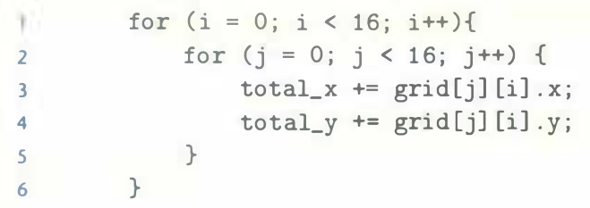

# Practice Problem 6.19 (solutionpage666)
Given the assumptions of Practice Problem 6.18, determine the cache performance of the following code:

A. What is the total number of reads?

B. What is the total number of reads that miss in the cache?

C. What is the miss rate?

D. What would the miss rate be if the cache were twice as big?

## Solution:

- Mapping of `grid` to sets 

    |row col|0|1|2|3|...|14|15|
    |-|-|-|-|-|-|-|-|
    |0|0|0|1|1|...|7|7|
    |...||||||||
    |7|56|56|57|57|...|63|63|
    |8|0|0|1|1|...|7|7|
    |...||||||||
    |15|56|56|57|57|...|63|63|

- `grid[8][0]` evicts the `grid[0][0]`, `grid[0][1]` block

- A. Total reads: 512
- B. Total reads that miss: 256
- C. Miss rate: 256/512 = 50%
- D. If the cache were twice as big, it could hold the entire `grid` array, the only misses would be the initial code misses, miss rate: 25%